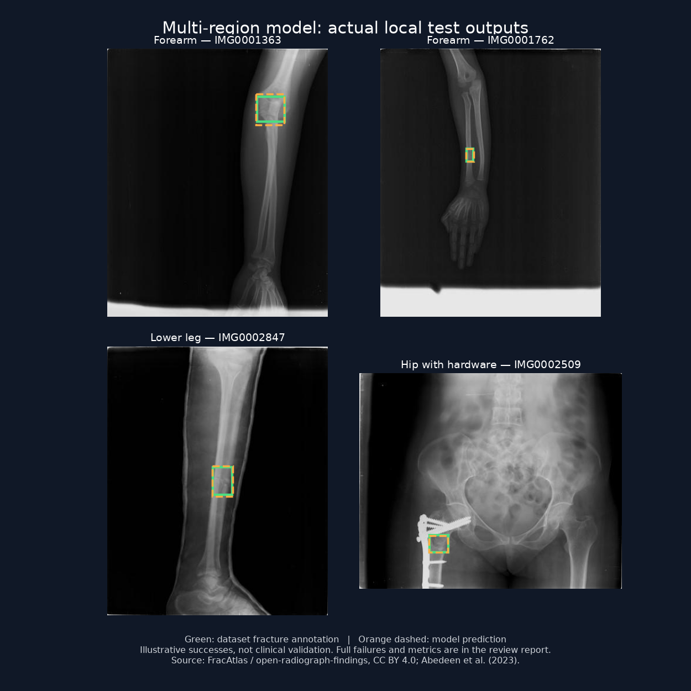

# Detection and reporting review — 2026-10-02

## Prepared changes — NOT DEPLOYED

- The user explicitly selects the Bone area. The wrist profile uses YOLO26s; the other-bones profile uses a separate YOLOv8s research checkpoint. Automatic anatomical routing was not reliable enough to enable.
- Wrist checkpoint: Public checkpoint: `Crimson-Dawn/grazpedwri-yolo26-checkpoints`, revision `01213afe2b4e978585339b3a0d5c6e23b38d538b`, run `hardneg_yolo26s_640_100epochs_seed42_20260918_123707_008523Z/weights/best.pt`.
- SHA256 `77fa47eb3bc463c114e4a442edd85652eaf55161706f95f05f39be4210782907`. Architecture metadata identifies `yolo26s.yaml`, 1 fracture class, 640 input, 100 training epochs. This is a trained checkpoint, not generic COCO weights. The publisher does not provide a full clinical validation/model card.
- Keep the existing 0.40 detection threshold. Ultralytics maps all boxes back from letterboxed model input to the original image; percentage coordinates remain clipped to the image. No synthetic boxes or static fake heatmaps.
- Image-level fracture classification is explicitly unconfirmed. Its score never becomes a diagnosis, location, or injury severity. A negative classifier never removes detector boxes.
- A localized fracture suspicion gets high **review priority**, not an assertion about displacement or clinical severity. Missing localization is inconclusive and requires clinical review. It does not establish a normal X-ray or minor injury.
- Image type uses independent CLIP prompt matching (`openai/clip-vit-base-patch32`, pinned revision `3d74acf9a28c67741b2f4f2ea7635f0aaf6f0268`). Disease-model confidence no longer changes the route. Uncertain inputs ask for manual category selection.
- EXIF/16-bit preprocessing is consistent, English reports are retained, PDF labels distinguish model score from severity, and the database accepts the `review` priority.

## Actual comparison at confidence 0.40 and IoU >= 0.50

Dataset: [open-radiograph-findings](https://huggingface.co/datasets/tirandazdylan/open-radiograph-findings), revision `20f26bf9436b23af8b6f9ae171f96d86f837bb17`, test rows 0–29 and 100–129, sourced from GRAZPEDWRI-DX, CC BY 4.0. Annotation boxes are normalized original-image xyxy. Matching uses one prediction per annotation. Overlap with the checkpoint author's training patients is **unknown**; these are engineering checks, not an independent clinical validation.

| Set / model | Annotated regions matched | Missed regions | Unmatched predicted boxes | Images without fracture annotation producing boxes |
|---|---:|---:|---:|---:|
| First 30 / YOLO11 | 25 / 33 | 8 | 2 | 1 / 5 |
| First 30 / YOLO26 | 29 / 33 | 4 | 0 | 0 / 5 |
| Next 30 / YOLO11 | 25 / 30 | 5 | 7 | 3 / 9 |
| Next 30 / YOLO26 | 28 / 30 | 2 | 3 | 0 / 9 |

Across these 60 wrist images: YOLO26 matched 57/63 annotated regions versus YOLO11's 50/63. It localized at least one annotated region in 45/46 fracture-annotated images versus 41/46. It still missed 6 annotated regions and produced 3 unmatched boxes. Absence of a fracture annotation is not a clinical guarantee of a healthy image.

A separate 24-image mixed-anatomy Roboflow/LibreYOLO check was poor for **both** models (only one of 15 fracture-class annotations matched at IoU >= 0.30). Several other public checkpoints also failed this check. Consequently **do not claim reliable whole-body fracture detection or clinical accuracy**. The wrist profile improves the tested pediatric-wrist task; the separate multi-region profile below has substantial remaining errors. No body part has independent clinical validation here. A newer YOLO version alone does not solve that limitation.

## Multi-region profile and actual broader test

Other bones use `MMMJavid/xray-fracture-localizer`, revision `d97e34132fb97d5b1163eba4ace3d49295b3e66f`, file `model.pt`, SHA256 `a206f388b2570ca89557868b61da50511ac99b9e7938f9cd9dd34d6690248a7b`. Checkpoint metadata identifies YOLOv8s, 100 training epochs, 640 input. The publisher's training dataset and patient split are not fully documented. Its performance here was better than the newer general candidates tested; version number alone was not a selection criterion. It performs poorly on the wrist sets, so the explicit wrist profile is essential.

The same dataset revision, test rows 273–328, provides 56 FracAtlas images: 23 fracture-annotated images with 30 regions, and 33 images without fracture annotations. At confidence 0.40 and IoU >= 0.50:

| Model | Regions matched | Regions missed | Unmatched boxes | Negative images with boxes | Positive images localized |
|---|---:|---:|---:|---:|---:|
| Previous YOLO11 | 2/30 | 28 | 12 | 6/33 | 1/23 |
| Multi-region YOLOv8s candidate | 25/30 | 5 | 11 | 8/33 | 20/23 |

The candidate improves localization recall here but produces more false positives on negative images. **This does not meet a demonstrated 90–95% unseen whole-body accuracy target.** Examples cover multiple regions, but coverage and performance for every bone, age and fracture type are not established. Training overlap with public checkpoints is unknown. No training or fine-tuning was performed on these examples. These sets influenced model selection and cannot serve as an untouched final test set. A new patient-disjoint, external evaluation is required.

Other tested general checkpoints matched 21/30 regions (adeebaai YOLOv8), 18/30 (XLR8-07 FracAtlas YOLOv8), 15/30 (Evangregor), and 12/30 (mathewprasanth YOLO26m) at the same criterion. No checkpoint solved generalization.

Green boxes are dataset annotations; orange dashed boxes are model outputs. These are selected successful examples, not a representative accuracy estimate. The hip example contains fixation hardware; box overlap does not determine whether a fracture is acute or healed. Source: Abedeen et al., FracAtlas (2023), distributed through open-radiograph-findings, CC BY 4.0; overlays and layout added for this review.

## Additional links supplied by the owner

The [Pelin pipeline](https://github.com/pelinbingl/Bone_Region_Identification/blob/main/combined_app.py) has seven upper-limb region classes and a binary fracture classifier. Its code runs the same fracture classifier for all regions; it does not switch per-region detectors and does not output boxes. Its published 97% and 99% classification results are not full-body localization validation. Leg and foot are absent from its region labels.

[WCAY](https://www.nature.com/articles/s41598-024-77878-6) is relevant detection research, but its 93.9% fracture-category AP is reported on GRAZPEDWRI-DX. It is not a universal whole-body accuracy percentage. The repository's current recursive main tree did not contain .pt/.pth/.onnx weights during this review. [Nidhul-paik](https://github.com/Nidhul-paik/fracture-detection) describes arm X-rays, not established whole-body validation. These projects were inspected, not integrated or benchmarked here.

## Verification

- Twelve backend regression tests cover coordinate clipping/non-square inputs, class filtering, preservation of real boxes despite classifier disagreement, classifier-only uncertainty, and independent routing with abstention.
- TypeScript check and frontend production build passed.
- Routing spot checks: 24 mixed bone X-rays, 5 wrist X-rays, 5 chest X-rays, and a photographed film were routed to the appropriate model family. Five images labelled "wound" in one public dataset were uncertain; visual inspection revealed a surgical practice board, so they were not treated as real-wound accuracy evidence.
- User-uploaded medical images, credentials, and downloaded model weights are excluded from this repository.

Do not use these uncalibrated model scores for clinical triage or to rule out a fracture. Diagnosis and urgency require qualified clinical interpretation.

## Deployment status

Review branch only. Production main is unchanged and branch automatic deployment is disabled. The compatible database `review` urgency constraint was applied earlier, before the owner requested deployment approval. App/model changes have not been deployed. Existing historical scans are not reprocessed automatically.
