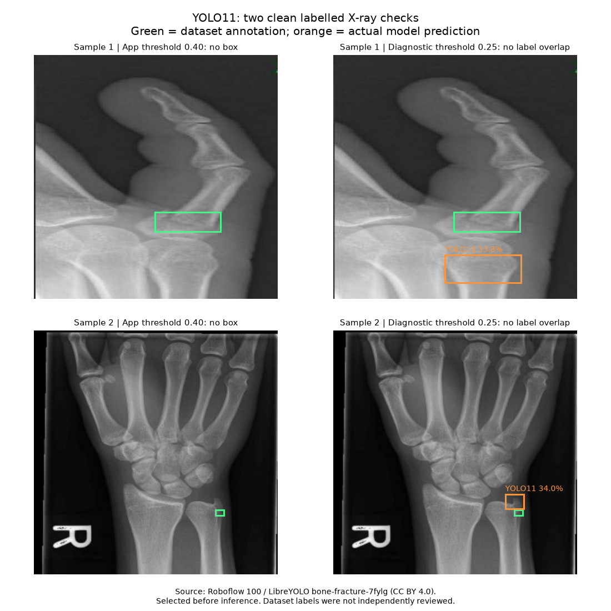

# Two clean X-ray localization checks

## Result

**Neither preselected fracture annotation was correctly localized.** At the application's 0.40 confidence threshold, YOLO11 returned no boxes on either image. At a diagnostic 0.25 threshold, it returned one box per image, but each box had zero intersection-over-union (IoU) with the corresponding dataset fracture annotation. Lowering the threshold therefore did not solve these cases. The application default was not changed in response to these failures.

| Sample | Annotated fractures | App boxes at 0.40 | Diagnostic confidence at 0.25 | Best annotation IoU |
| --- | ---: | ---: | ---: | ---: |
| 118 (thumb view) | 1 | 0 | 33.8% | 0.000 |
| 124 (wrist view) | 1 | 0 | 34.0% | 0.000 |



Green boxes are dataset reference annotations, not model predictions. Orange boxes are the actual detector predictions in the lower-threshold diagnostic. The visualization is an evaluation figure, not an application screenshot. No image was cropped, cleaned, or enhanced before inference. The unannotated source files contain no stock-photo watermark or pre-drawn fracture box.

## Source and selection

- Dataset: [Roboflow 100 bone-fracture-7fylg](https://universe.roboflow.com/roboflow-100/bone-fracture-7fylg/dataset/1), mirrored by [LibreYOLO on Hugging Face](https://huggingface.co/datasets/LibreYOLO/bone-fracture-7fylg).
- License: CC BY 4.0, as declared in the dataset card/configuration. Attribution: Roboflow 100 contributors; Ciaglia et al., *Roboflow 100: A Rich, Multi-Domain Object Detection Benchmark* (2022).
- Pinned dataset revision: `c5c74eb4e6050d217f37a965666974e8cee39f8e`.
- These are the first two alphabetically sorted test images whose labels include class 1 (`fracture`). Selection happened before inference. Failed results were retained.
- Exact filenames and source/label URLs are in [the machine-readable results](evaluation/yolo11-clean-tests.json).
- The annotations were not independently reviewed by a radiologist here. Overlap with the checkpoint's training data is unknown. This two-image smoke check is not a clinical accuracy benchmark.

## Inference and interpretation

Actual application function: `app.services.fracture_model.predict_fractures`, with the pinned `Jesteban247/yolo11-fracture-onnx` checkpoint, 640 input, CPU ONNX Runtime, NMS IoU 0.45. Source images are 640 x 640. The diagnostic additionally inspected all detections down to 0.05; those extra detections also had zero overlap with the reference annotations. Raw detections are retained in the JSON.

The earlier screenshot example produced a plausible 52.5% fracture box, but it lacked independent ground truth and did not establish general accuracy. These clean-image failures show why upgrading the YOLO version alone cannot guarantee accurate localization. The code now preserves genuine detector coordinates and displays all fracture boxes, but it cannot invent a correct box when the checkpoint misses the fracture. Better validated weights or additional training are still needed before claiming the accuracy problem is solved.

Findings from both tests were in English (`No fracture box localized`). The other model implementations, existing UI language selector and design are unchanged. This run evaluates YOLO localization; it does not revalidate the entire deployed model ensemble or remote report service.

## Reproduce

From `backend/`, configure `.env`, install requirements and run:

```bash
python download_fracture_model.py
python scripts/check_yolo11_samples.py --output-dir ../review.local/clean-tests
```

The script downloads the same two public originals and labels, runs real inference, and records the model output and IoU for every reference annotation. It does not fail the process just because accuracy is poor; inspect `results.json`.
